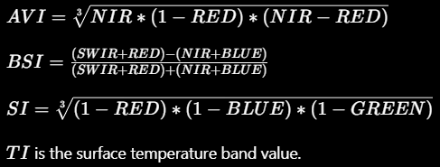

# Damagundam Forest Canopy Density (FCD)

Author: [Sai Krishna Dammalapati](https://d-saikrishna.github.io/)

[Damagundam Reserve Forest](https://maps.app.goo.gl/WeMjbBzgtSwFhztp8) is about 80 km from the city of Hyderabad near Pudur Village, Rangareddy District, Telangana.

About 1185 hectares (2900 acres) of the Damagundam forest land is allowed to be diverted to setup a VLF Radar Station/Naval Base.

This GIS project is to assist the [SaveDamagundam Forest](https://www.instagram.com/savedamagundamforest/) group in measuring the deforestation that happened in Damagundam over the last decade (2014-23).

## Data
All satellite imagery are from [LANDSAT8 Surface Reflectance](https://developers.google.com/earth-engine/datasets/catalog/LANDSAT_LC08_C02_T1_L2#description) products from Google Earth.

| Band    | Description |
| -------- | ------- |
| SR_B2  | BLUE    |
| SR_B3 | GREEN     |
| SR_B4    | RED    |
| SR_B5    | NIR (Near Infrared)    |
| SR_B7    | SWIR (shortwave infrared 2)    |
| ST_B10    | TI (Surface Temperature)    |

FCD is calculated over once composite image generated for years 2014, 2019 and 2023 each.

In the Telangana State, October-December are relatively cloud-free areas. So, a mean composite image is generated based on images in these months. It is also post the monsoons, so I assume it to be the greenest part of the forest.

Damagundam forest polygons are obtained from field groups.
`data\shapefiles\ForestArea_Damagundam.shp`

## Method

I calculate the Forest Canopy Density (FCD) over the Damagundam Forest area for years 2014, 2019 and 2023. This Google Earth Engine Code will help in replicating the method - [Link](https://code.earthengine.google.com/c4975926ea5ae6f56bcf6c911723aaeb)

Following indices are building blocks of FCD calculation.

1. Advanced Vegetation Index (AVI)
2. Bare Soil Index (BSI)
3. Shadow Index (SI)
4. Thermal Index (TI)

All these individual indices are also presented in the repository. 
`results\indices_tifs\`

Principal Component Analysis (PCA) is done to calculate two indixes from the above 4 indices. I referred to [Ujaval Gandhi's PCA tutorial](https://courses.spatialthoughts.com/end-to-end-gee-supplement.html#principal-component-analysis-pca) to do this.

1. **Vegetation Density (VD)**: It is the first PCA of AVI and BSI. 
2. **Scaled Shadow Index (SSI)**: It is the first PCA of TI and SI.

Both VD and SSI are normalised using min-max normalisation to get their values in the range 0-100.

FCD is then calculated using the formula:

The value of FCD ranges form 0-1.

Forest Type is then calculated using the following classification:

| FCD Range    | Forest Type |
| -------- | ------- |
| 0 - 0.1  | Scrub    |
| 0.1 - 0.4 | Open     |
| 0.4 - 0.7    | Dense    |
| 0.7 - 1    | Very Dense    |

# Results

Compared to 2014, the scrub forest type has increased from 16% to 37% (in 2019) and 45% (in 2023). Corresponding reduction in the open forest type is observed.

This method of FCD calculation did not find any dense and very dense forest in the Damagundam forest area. This has to be ground-truthed.

More forest degradation can be observed in the central part of the forest area -- near Thirmalapur and Somangurthy villages.

High res images can be found in the `results` folder.

## References:
1. [FCD Formulae](https://erepo.uef.fi/bitstream/123456789/21667/1/urn_nbn_fi_uef-20190739.pdf)
2. [FCD Ranges](https://www.fsi.nic.in/sfr2003/forestcover.pdf)
3. [Thermal Index Formula](https://iopscience.iop.org/article/10.1088/1755-1315/98/1/012056/pdf)
